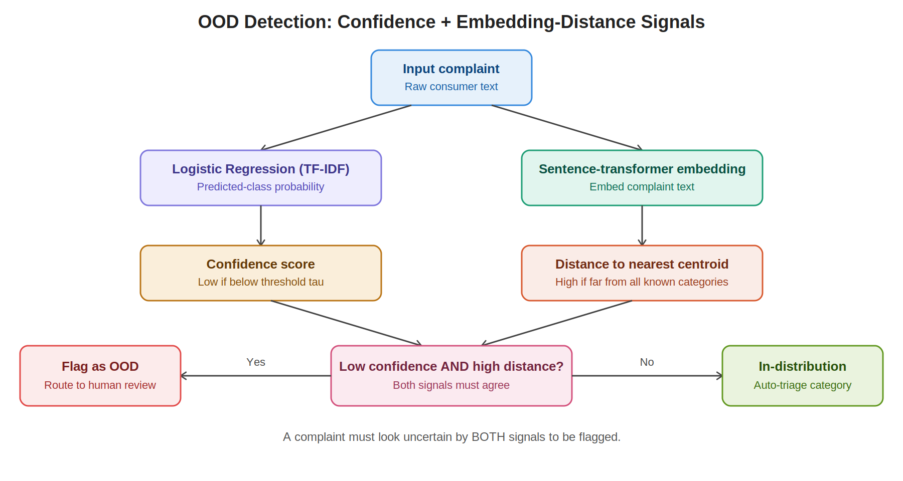

# CFPB Complaint Triage

An end-to-end system that automatically classifies and prioritizes real consumer complaints filed with the CFPB (Consumer Financial Protection Bureau). It predicts complaint category and urgency, flags complaints the model shouldn't be trusted on, and suggests a next resolution step. Built on live CFPB data, not a static Kaggle dump.

## Dataset

Pulled directly from the [live CFPB Consumer Complaint Database API](https://www.consumerfinance.gov/data-research/consumer-complaints/), so this is real, ongoing complaint data, not a fixed academic benchmark. To avoid skewing toward one season or news event, the sample spans several 3month windows across ~2 years, pulled as separate API calls and combined. The topN most frequent product categories are kept, the same reasoning a real triage team would use: support the top departments well rather than 40 categories with 10 examples each.

CFPB doesn't provide an urgency label, so one was built from scratch using a documented keyword rubric against the `issue`/`sub_issue` fields.

## Pipeline overview

| Stage | What it does | Where |
|---|---|---|
| 1. Data collection | Pulls complaints across multiple time windows from the live CFPB API | `src/cfpb_download.py`, `notebooks/01_eda_preprocessing.ipynb` |
| 2. EDA and cleaning | Category balance, text length, duplicates; text cleaning that preserves CFPB's `XXXX` PII redaction tokens (informative: dense redaction often signals financial account details) | `notebooks/01_eda_preprocessing.ipynb` |
| 3. Urgency labeling | Rulebased keyword rubric (CFPB has no urgency field)  | `notebooks/01_eda_preprocessing.ipynb` |
| 4. TFIDF baselines | Logistic Regression and SVM for category (top8way) and urgency (3way), class weighted to counter the skew toward low/medium urgency | `notebooks/02_tfidf_ml_models.ipynb` |
| 5. DistilBERT fine tuning | Two independently fine tuned DistilBERT models (category, urgency) via Hugging Face `Trainer` | `notebooks/03_distilbert_transformer.ipynb`, `src/category_urgency.py` |
| 6. OOD detection | Flags complaints the model shouldn't auto triage (using Logistic Regression confidence plus embedding distance), routing them to a human instead | `src/ood_detector.py`, `notebooks/04_triage_pipeline.ipynb` |
| 7. Resolution suggestion | Suggests a next step based on predicted category/urgency | `src/resolution_suggester.py` |
| 8. Full pipeline and comparison | Wires everything together and produces the model comparison below | `notebooks/04_triage_pipeline.ipynb` |
| 9. Demo app | Streamlit app reusing the exact same triage logic as the pipeline | `app/app.py` |

**Error cost awareness:** urgency misclassification isn't treated as symmetric. A `high` urgency complaint predicted as `low` is a materially worse mistake than the reverse (a missed urgent case vs. an over cautious flag), so the confusion matrix is read with that asymmetry in mind rather than judged on raw accuracy alone.

## Out of distribution (OOD) detection

Rather than relying on softmax confidence alone, the OOD detector combines two signals: the **Logistic Regression (TFIDF) classifier's** predicted probability confidence on its top predicted class, and the **embedding distance** from the complaint to its nearest known category centroid (computed with a lightweight sentence transformer). A complaint that is *both* low confidence *and* far from every known category centroid gets flagged as OOD and routed to human review instead of being auto triaged. This catches cases that look confident by one signal alone but not the other.



## Results

| Model | Task | Accuracy | Macro F1 |
|---|---|---|---|
| Logistic Regression (TFIDF) | Category | 0.854 | 0.653 |
| SVM (TFIDF) | Category | 0.878 | 0.657 |
| Logistic Regression (TFIDF) | Urgency | 0.748 | 0.640 |
| SVM (TFIDF) | Urgency | 0.756 | 0.605 |
| DistilBERT (fine tuned) | Category | 0.788 | 0.491 |
| DistilBERT (fine tuned) | Urgency | 0.638 | 0.499 |


The TFIDF baselines edge out DistilBERT on both accuracy and macro F1 here, a useful reminder that a well tuned, class weighted classical baseline can outperform a transformer on imbalanced, short text classification, especially without extensive fine tuning. A natural next step (noted as a stretch goal in the fine tuning notebook) is a single multi task DistilBERT sharing representations across category and urgency, since the two labels are correlated and urgency prediction here is largely keyword driven, exactly where TFIDF has a natural edge.

## Demo

The Streamlit app (`app/app.py`) lets you paste in a complaint and see the predicted category, urgency, and OOD flag in real time.


To run it locally:
```bash
streamlit run app/app.py
```

## Setup

```bash
python -m venv venv
venv\Scripts\activate
pip install -r requirements.txt
```

## Project structure

```
cfpb_triage_final/
├── app/
│   └── app.py
├── data/
├── models/
├── notebooks/
│   ├── 01_eda_preprocessing.ipynb
│   ├── 02_tfidf_ml_models.ipynb
│   ├── 03_distilbert_transformer.ipynb
│   └── 04_triage_pipeline.ipynb
├── src/
│   ├── cfpb_download.py
│   ├── category_urgency.py
│   ├── ood_detector.py
│   └── resolution_suggester.py
├── assets/
│   └── comparison_plot.png
├── ood_detection_flow.png
├── app_demo.png
└── requirements.txt
```

**Note on model weights:** the fine tuned DistilBERT checkpoints (`models/*.safetensors`) are excluded from this repo since they exceed GitHub's 100MB file limit. Run `notebooks/03_distilbert_transformer.ipynb` to reproduce them.
